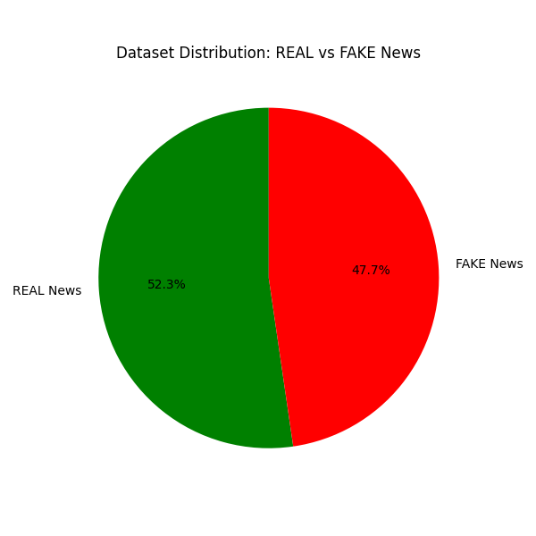
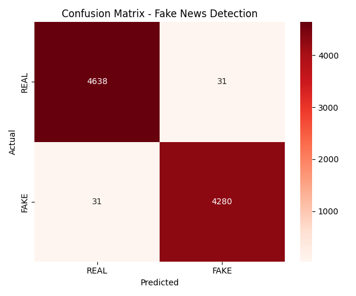
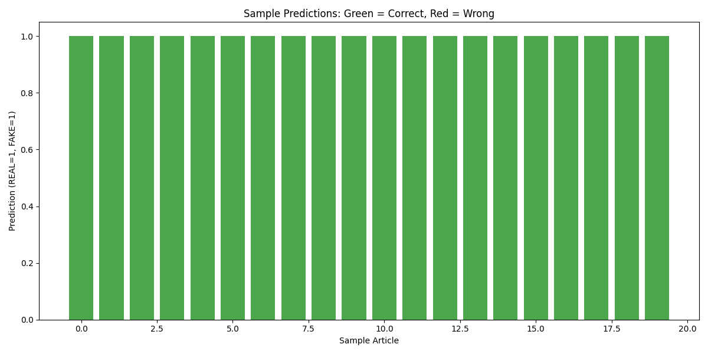

# Fake News Detector

NLP model that detects fake news with 99.31% accuracy using 44,898 real and fake news articles.

**By Padma Shree** | Project 9 of 25

---

## The Problem

Fake news spreads faster than real news. Social media amplifies false information. People share without verifying. The damage — from elections to health crises — is real and measurable.

Fact-checking is slow. Manual verification does not scale. India needs automated tools to flag fake news before it spreads.

---

## What I Built

A Natural Language Processing (NLP) model that classifies news articles as REAL or FAKE using:

- TF-IDF vectorization (converts text to numbers)
- PassiveAggressiveClassifier (fast text classification)
- 44,898 articles for training and testing

---

## Results

| Metric | Value |
|--------|-------|
| Accuracy | 99.31% |
| Total articles | 44,898 |
| REAL news | 21,417 |
| FAKE news | 23,481 |
| Correct predictions | 8,918 out of 8,980 |

---

## Confusion Matrix

| | Predicted REAL | Predicted FAKE |
|---|---------------|----------------|
| Actually REAL | 4,638 | 31 |
| Actually FAKE | 31 | 4,280 |

**False Positives:** 31 articles (REAL marked as FAKE)
**False Negatives:** 31 articles (FAKE marked as REAL)

---

## Charts

### Dataset Distribution



### Confusion Matrix Heatmap



### Sample Predictions (First 20 Test Articles)



---

## Tech Stack

- Python
- Pandas, NumPy
- Scikit-learn (TfidfVectorizer, PassiveAggressiveClassifier)
- Matplotlib, Seaborn

---

## How to Run

```bash
pip install pandas scikit-learn matplotlib seaborn
python fake_news_model.py
